# Neuron

**Transform any codebase into a queryable, scored knowledge graph — with health grades, architecture fitness rules, and interactive exploration.**

Neuron scans your project, parses every file using tree-sitter AST extraction, builds a knowledge graph of entities and relationships, clusters them into communities, scores each module's health from A to F, and gives you an interactive visualization to explore it all.

> No embeddings. No API keys for code. Deterministic AST parsing. Your code never leaves your machine.

```bash
neuron build .
```

```
Scanning files...        Found 26 files across 2 languages
Extracting entities...   Extracted 266 entities, 1939 relations
Building graph...        624 nodes, 1301 edges
Detecting communities... 23 communities via louvain
Health scores...         Overall health: B (82%)
```

---

## Why Neuron?

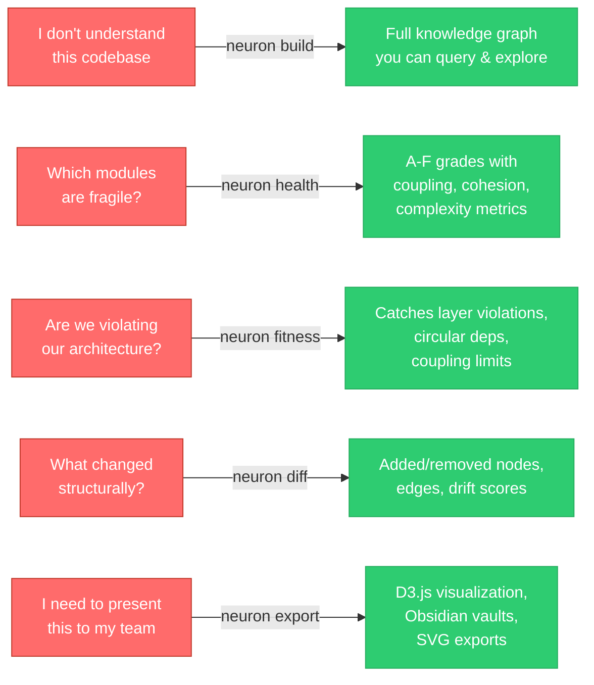

---

## Installation

```bash
pip install neuron-graph
```

Or from source:

```bash
git clone https://github.com/kartikjha/neuron.git
cd neuron
pip install -e ".[all]"
```

### Optional Extras

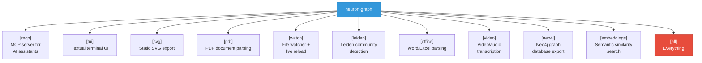

```bash
pip install neuron-graph[mcp]        # MCP server for AI assistants
pip install neuron-graph[all]        # Everything
```

---

## Quick Start

### Build a knowledge graph

```bash
neuron build /path/to/your/project
```

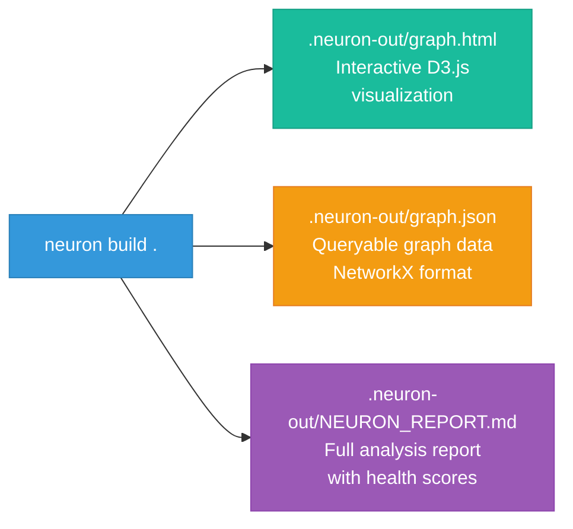

### Query the graph

```bash
neuron query "UserService" --depth 3
```

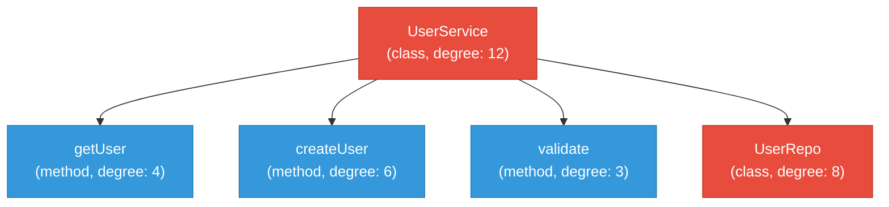

### Check codebase health

```bash
neuron health
```

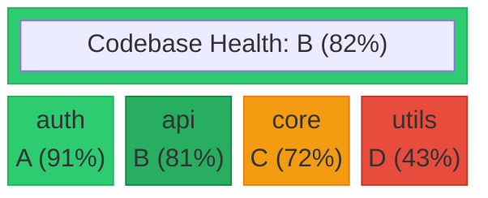

### Check architecture fitness

```bash
neuron fitness
```

Create a `neuron-fitness.yaml` in your project root:

```yaml
rules:
  - name: no-ui-to-db
    kind: no-depend
    source: "ui/*"
    target: "db/*"
    severity: error

  - name: max-service-coupling
    kind: max-coupling
    source: "services/*"
    threshold: 10
    severity: warning

  - name: layered-architecture
    kind: layer-order
    layers: [controller, service, repository]
    severity: error

  - name: no-circular-deps
    kind: no-circular
    source: "services/*"
    severity: error
```

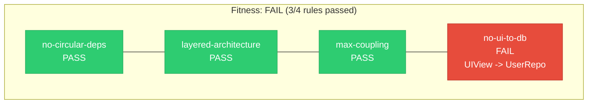

### Compare graph snapshots

```bash
neuron diff old-graph.json new-graph.json
```

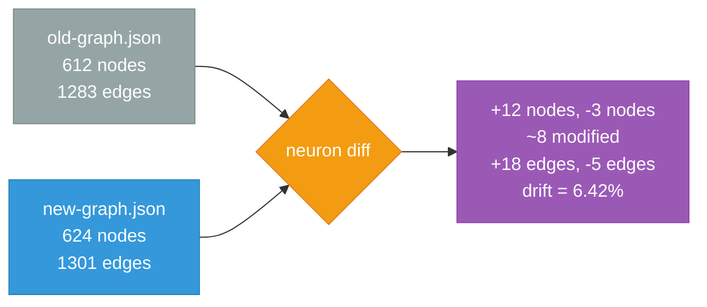

### Explore interactively in the terminal

```bash
neuron explore
```

```
neuron> search UserService
neuron> node UserService
neuron> neighbors UserService
neuron> path UserService -> Database
neuron> tree UserService
neuron> gods
neuron> health
neuron> community 3
neuron> quit
```

### Watch for changes

```bash
neuron watch .
```

Auto-rebuilds the graph when files change.

### Start MCP server

```bash
neuron serve .neuron-out/graph.json
```

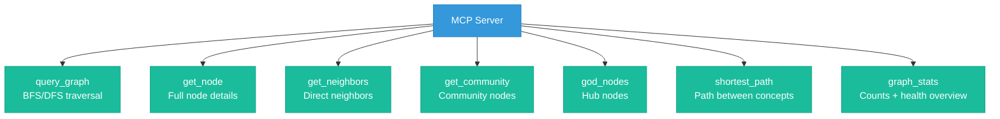

Works with Claude Code, Cursor, Codex, and any MCP-compatible tool.

---

## The Pipeline


Each stage is a pure function in its own module. No global state.

### 1. Detect

Walks your project directory. Classifies every file by type and language. Finds package manifests (`package.json`, `Cargo.toml`, `go.mod`, `pyproject.toml`, etc.). Respects `.neuronignore`. Skips sensitive files (keys, credentials, `.env`).

### 2. Extract

Uses **tree-sitter** for deterministic AST extraction across languages. Zero API calls for code. Extracts:

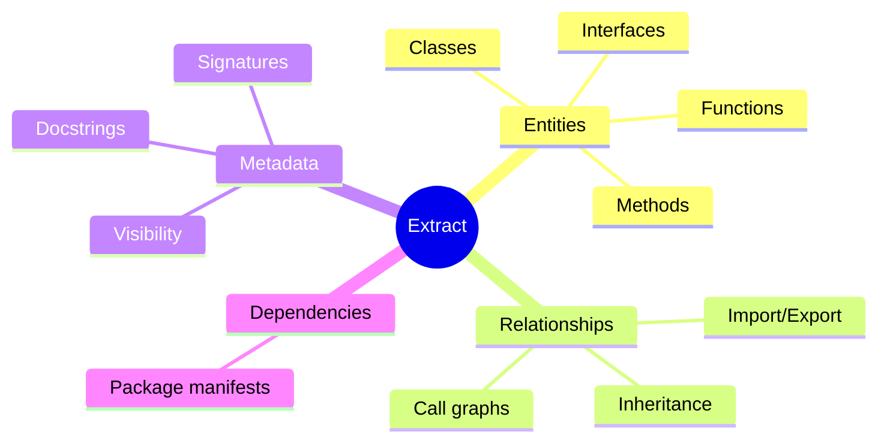

**Supported languages:** Python, JavaScript, TypeScript, Go, Rust, Java, C, C++, Ruby, C#, Kotlin, Scala, PHP, Swift, and more.

### 3. Build

Merges all extraction results into a **NetworkX** graph. Resolves cross-file references (when `module_b` imports `ClassA` from `module_a`, those nodes get connected). Deduplicates entities. Tags external dependencies.

### 4. Cluster

Runs **Leiden** community detection (or falls back to **Louvain**). Automatically splits oversized communities. Builds a hierarchy of nested sub-communities with cohesion scores and inter-community relationship maps.

### 5. Analyze

Computes four centrality metrics for every node (degree, betweenness, eigenvector, closeness). Identifies:

- **God nodes** -- entities with disproportionately high connectivity, with risk scores
- **Bridge nodes** -- nodes that span multiple communities (potential architectural seams)
- **Surprising connections** -- unexpected cross-community, cross-file edges ranked by composite surprise score
- **Suggested questions** -- investigation prompts generated from structural analysis

### 6. Health Score

Computes **per-module health grades** (A through F) based on three dimensions:

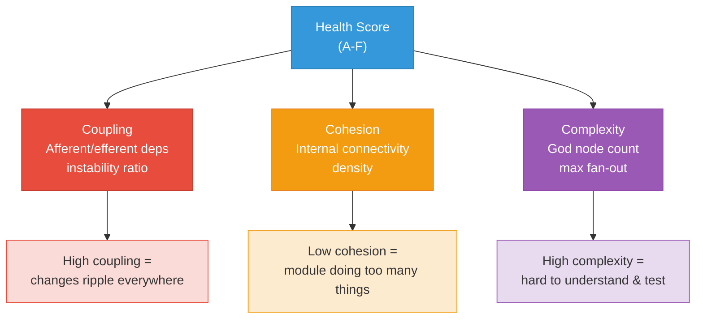

Identifies **hotspots** (worst modules) and generates **actionable recommendations** for refactoring.

### 7. Fitness Rules

Evaluates your architecture constraints defined in `neuron-fitness.yaml`:

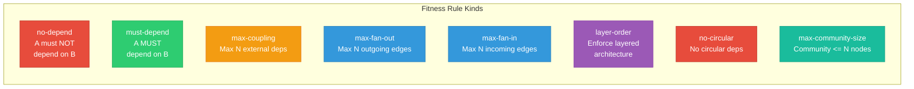

### 8. Report

Generates `NEURON_REPORT.md` with everything: health dashboard, module scores, hotspots, fitness violations, god nodes, bridge nodes, surprising connections, community breakdowns, recommendations, and suggested investigation questions.

### 9. Export

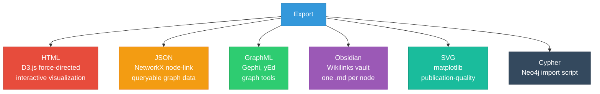

---

## Confidence Tags

Every edge in the graph is tagged with a confidence level:

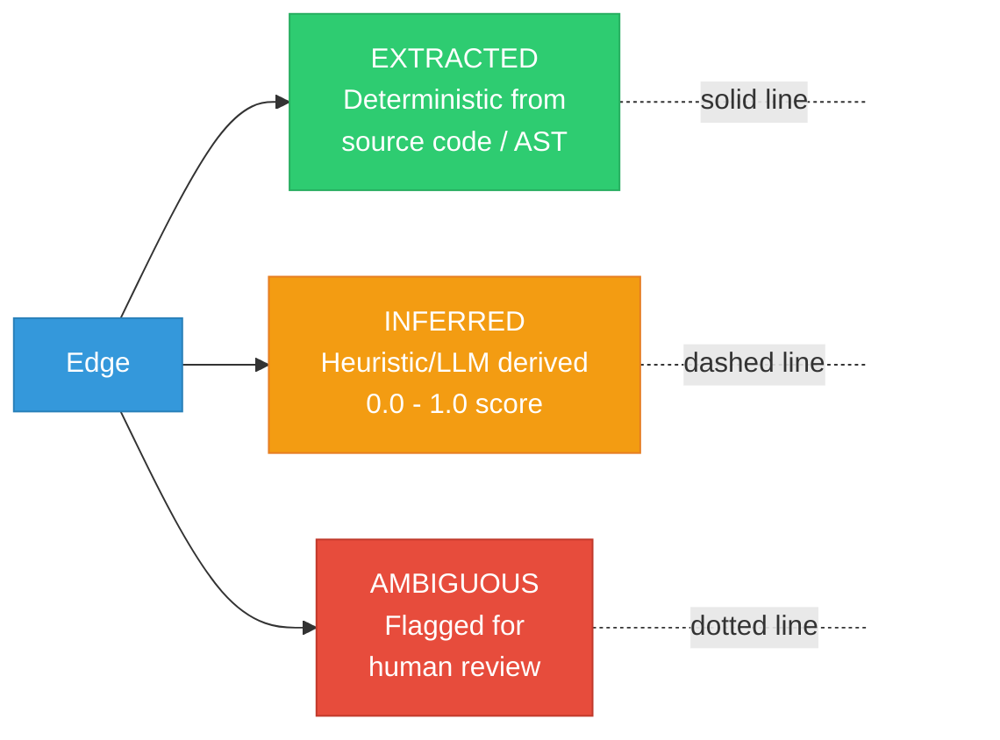

---

## Use as an AI Skill

Neuron works as a `/neuron` slash command in AI coding assistants:

```
/neuron              Build full knowledge graph
/neuron query <x>    Query the graph
/neuron health       Show health scores
/neuron fitness      Check architecture rules
/neuron diff         Compare snapshots
/neuron explore      Terminal explorer
```

Works with Claude Code, Cursor, Codex, and any MCP-compatible tool.

---

## Configuration

### `.neuronignore`

Same syntax as `.gitignore`. Controls which files to skip:

```
# Skip generated code
*.generated.ts
proto/**

# Skip vendored deps
third_party/
```

### `neuron-fitness.yaml`

Architecture fitness rules. Generate a starter template:

```bash
neuron fitness-init
```

---

## Caching

Neuron caches extraction results using SHA256 file hashes. Re-runs only process files that changed. Cache is stored in `.neuron-out/.cache/`.

---

## How Is This Different?

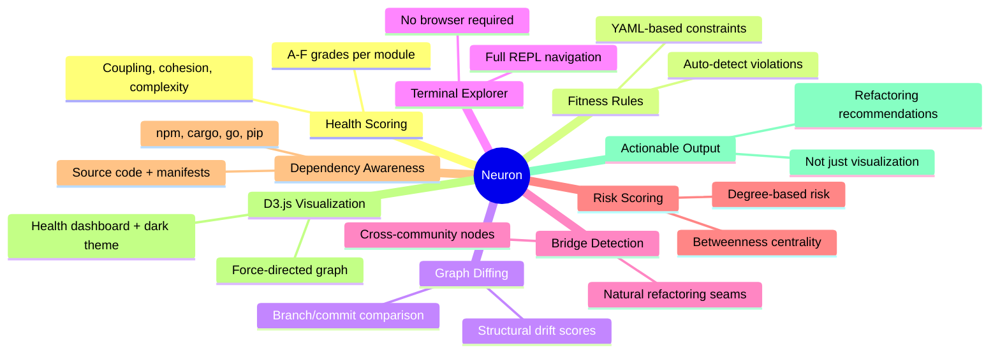

---

## Project Structure

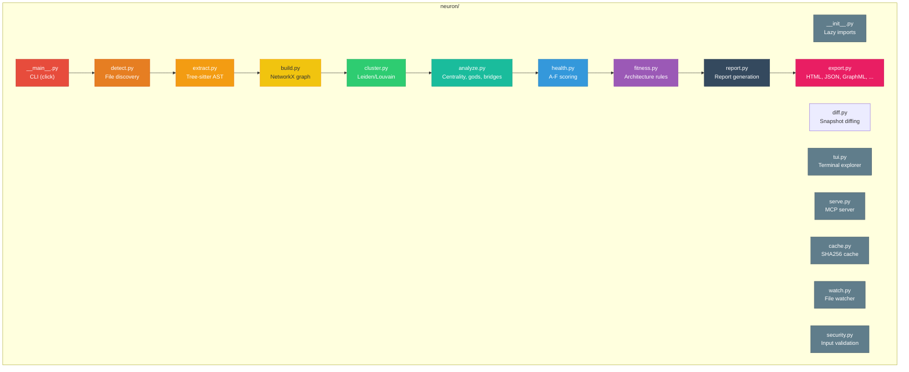

---

## License

MIT

---

Built by [Kartik Jha](https://github.com/kartikjha).
